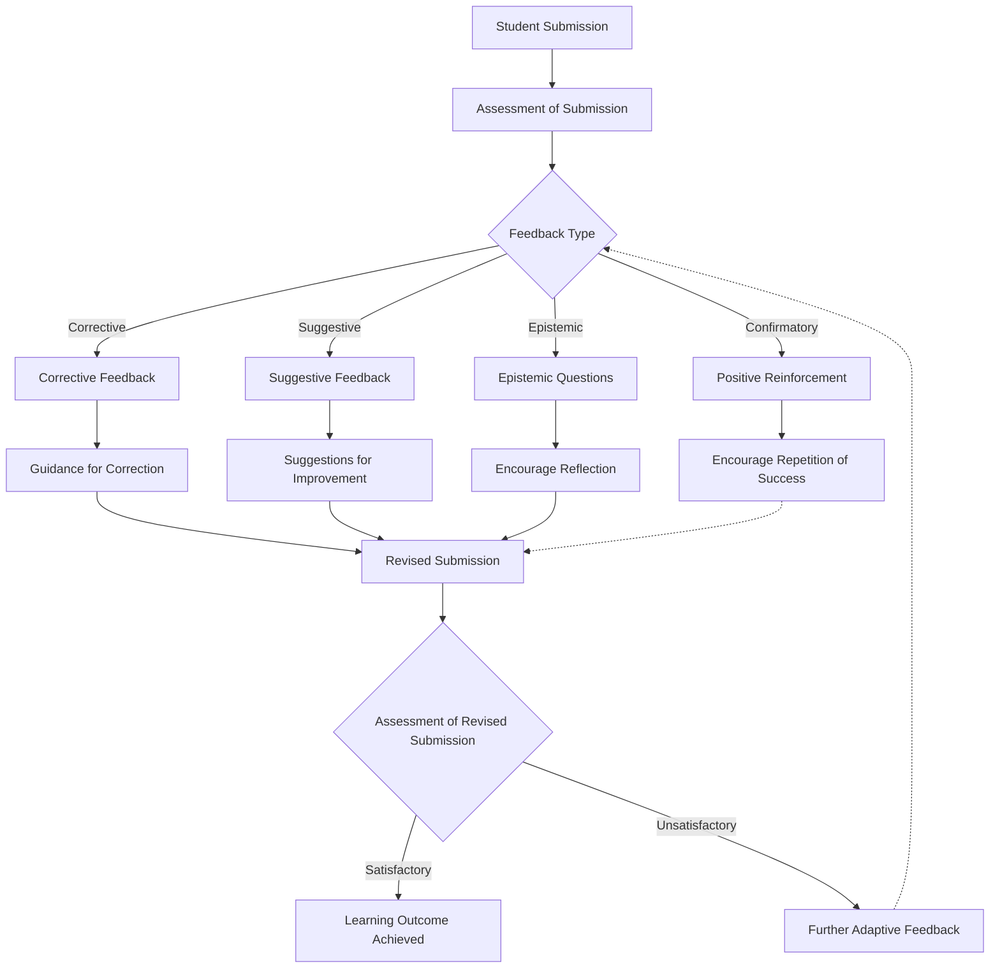

This diagram illustrates the adaptive constructive feedback process in education:

    Student Submission: The process starts with a student submitting an assignment or answering a question.
    Assessment of Submission: The teacher or an automated system assesses the submission to determine its quality and correctness.
    Feedback Type: Depending on the assessment, the feedback can be classified into several types:
        Corrective Feedback: Points out mistakes and provides the correct answers.
        Suggestive Feedback: Offers suggestions on how to improve the work or explore new learning strategies.
        Epistemic Questions: Poses questions that encourage deeper thinking and reflection on the topic.
        Confirmatory Feedback: Provides positive reinforcement for correct answers or approaches.
    Feedback Implementation: The student receives specific feedback based on the type determined:
        Guidance for Correction, Suggestions for Improvement, and Encourage Reflection lead to a revised submission.
        Encourage Repetition of Success indirectly influences future submissions by reinforcing successful behavior.
    Revised Submission and Further Assessment: The cycle repeats with the student making a revised submission based on the feedback, which is then reassessed.
    Outcome: If the learning outcome is achieved, the process ends. Otherwise, further adaptive feedback is provided, restarting the cycle.
